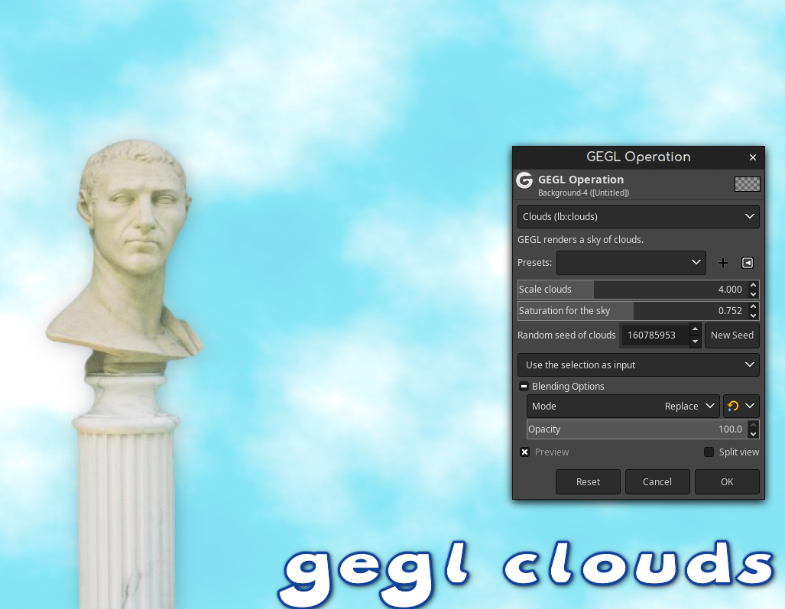

# GEGL CLouds

A new Gimp filter where GEGL renders a pattern of clouds. Binaries are in the releases section but you can also compile. 

## OS specific location to put GEGL Filter binaries 

Windows
C:\Users\USERNAME\AppData\Local\gegl-0.4\plug-ins
 
 Linux 
`~/.local/share/gegl-0.4/plug-ins`
 
 Linux (Flatpak)
`~/.var/app/org.gimp.GIMP/data/gegl-0.4/plug-ins`

## Compiling and Installing

Just run ./build_plugin_OS.sh or

Linux

To compile and install you will need the GEGL header files (libgegl-dev on Debian based distributions or gegl on Arch Linux) and meson (meson on most distributions).

meson setup --buildtype=release build
ninja -C build

If you have an older version of gegl you may need to copy to ~/.local/share/gegl-0.3/plug-ins instead (on Ubuntu 18.04 for example).
Windows

The easiest way to compile this project on Windows is by using msys2. Download and install it from here: https://www.msys2.org/

Open a msys2 terminal with C:\msys64\mingw64.exe. Run the following to install required build dependencies:

pacman --noconfirm -S base-devel mingw-w64-x86_64-toolchain mingw-w64-x86_64-meson mingw-w64-x86_64-gegl

Then build the same way you would on Linux:

meson setup --buildtype=release build
ninja -C build

## more pics of this based plugin

